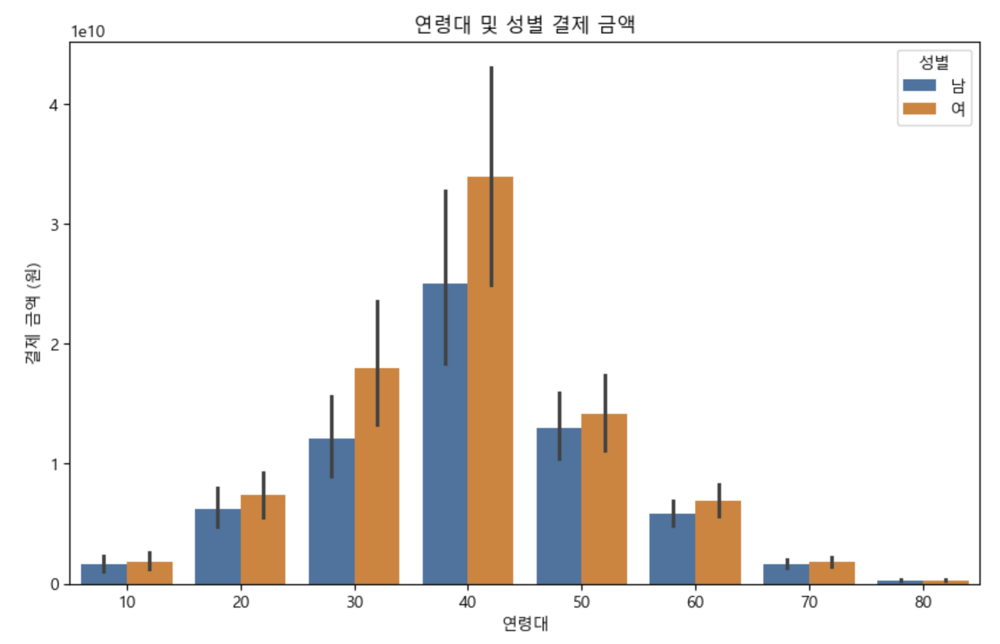
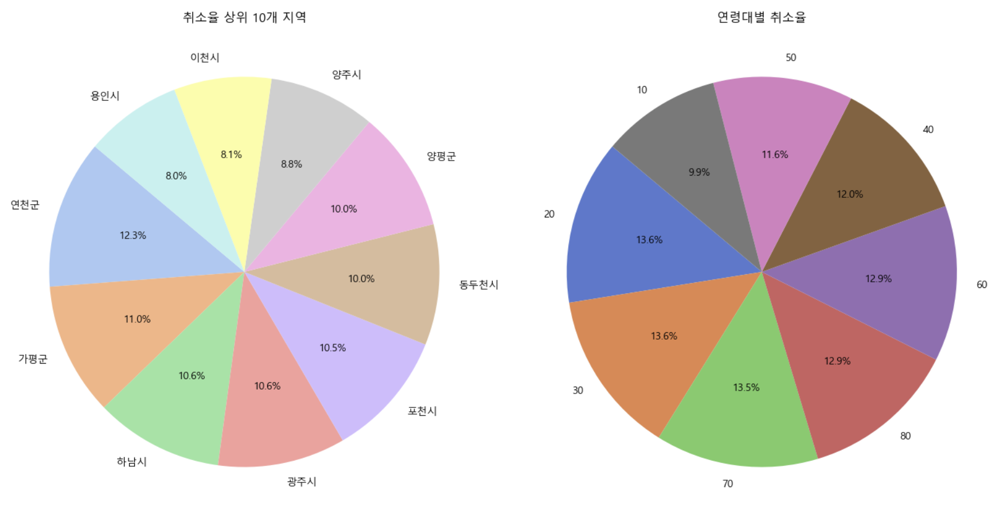

# 지역화폐 데이터 분석 프로젝트

## 📌 프로젝트 개요
본 프로젝트는 파이썬과 주피터 노트북을 활용하여 지역화폐 사용 현황 데이터를 분석하고 시각화하여, 지역화폐의 사용 특성을 파악하고 지역 경제 활성화를 위한 정책적 제안을 도출하는 것을 목표로 합니다.

---

## 🎯 프로젝트 목표
- 연령대 및 지역별 지역화폐 사용 패턴 분석
- 지역화폐 사용 빈도 및 결제금액 변화율 분석
- 지역화폐 가맹점 현황과 이용자 특성(연령대별, 성별) 분석
- 데이터 시각화를 통한 직관적인 결과 제공

---

## 🔍 연구 방법

### 1️⃣ 데이터 수집 및 준비
- **데이터 소스**:
  - 연령별 거주인구 대비 지역화폐 사용금액 현황.csv
  - 연령별 지역화폐 사용 빈도 현황.csv
  - 지역별 지역화폐 결제금액 및 결제변화율.csv
  - 지역화폐가맹점현황.csv
  - 지역화폐연령별성별이용현황.csv

- **데이터 형식**: CSV 파일

### 2️⃣ 데이터 전처리 및 분석
- 결측치 처리 (0 또는 기타 값으로 대체)
- pandas 라이브러리를 활용한 데이터 처리 및 분석 수행

### 3️⃣ 데이터 시각화
- matplotlib과 seaborn을 활용한 다양한 그래프 생성:
  - 연령대 및 성별 결제금액 비교 그래프
  - 결제 취소율 상위 지역 분석 그래프
  - 연령대별 취소율 원 그래프 등

### 4️⃣ 연구 설계
- **연구 질문**: "지역화폐 사용 패턴은 연령대와 지역에 따라 어떻게 차이가 나는가?"
- **연구 가설**: "연령대와 지역에 따라 지역화폐의 사용 빈도와 금액에 유의미한 차이가 존재할 것이다."
- **분석 절차**: 데이터 수집 → 전처리 → 분석 → 시각화 → 결과 해석 및 정책 제안

---

## 🛠️ 기술 스택 (Tech Stack)

| 기술 | 로고 |
|------|------|
| Python |  |
| Jupyter Notebook |  |
| pandas |  |
| matplotlib |  |
| seaborn |  |

---

## 📊 주요 결과 예시 이미지

### 🔸 연령대 및 성별 결제 금액 비교 
![연령대 및 성별 결제 금액]

### 🔸 결제 취소율 상위 10개 지역 
![결제 취소율 상위 10개 지역]

---

## 📈 기대 효과 및 정책적 제안
본 연구를 통해 얻어진 인사이트를 바탕으로, 지자체는 연령대와 성별, 지역 특성에 맞춘 맞춤형 홍보 전략과 가맹점 확대 전략을 수립할 수 있을 것으로 기대됩니다.

---

## 📌 실행 방법
1. 본 저장소를 클론(Clone)합니다.
2. 필요한 라이브러리를 설치합니다.
